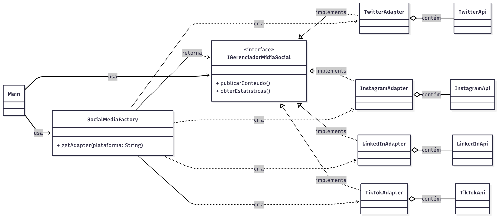

# Sistema Unificado de Mídia Social (Padrão Adapter)

## 🎯 Objetivo

Implementar um sistema unificado em Java para gerenciar a publicação e obtenção de dados em quatro redes sociais distintas (Twitter, Instagram, LinkedIn, TikTok), superando a incompatibilidade de suas APIs através do padrão **Adapter**.

## 🛠️ Padrões e Conceitos Chave

| Padrão/Conceito | Explicação |
| :--- | :--- |
| **Adapter Pattern** | Permite que as APIs originais (`*Api`, o *Adaptee*) trabalhem com a interface unificada (`IGerenciadorMidiaSocial`, o *Target*). Cada `*Adapter` traduz as chamadas. |
| **Factory Method** | A classe `SocialMediaFactory` gerencia a criação dinâmica e desacoplada de Adapters. |
| **Composition over Inheritance** | Os Adapters utilizam composição (contendo a instância da `*Api`) para garantir flexibilidade e baixo acoplamento. |
| **Resposta Unificada** | Utilização da classe genérica `RespostaUnificada<T>` para padronizar o retorno de todas as operações, incluindo tratamento de erro granular. |
| **Requisitos Técnicos** | Não modificação de APIs originais, thread-safe (via `ReentrantLock`), e uso de Generics. |

## 📁 Estrutura do Projeto

O código está organizado nos seguintes pacotes, que refletem os componentes do padrão Adapter:

-   `agencia.core`: Interface Unificada (`IGerenciadorMidiaSocial`).
-   `agencia.apis`: Simulação das APIs Originais.
-   `agencia.adapters`: Implementação dos Adapters.
-   `agencia.factory`: Fábrica de Adapters (`SocialMediaFactory`).
-   `agencia.models`: Modelos de Dados Genéricos.

## 🖼️ Diagrama de Classes (Padrão Adapter)

O diagrama de classes abaixo ilustra as relações de implementação (Adapter), composição (Adapters e APIs) e criação (Factory Method) entre os componentes principais do sistema.

A atividade foi feita pelas alunas: Laura, Maiara e Mariana em sala de aula.